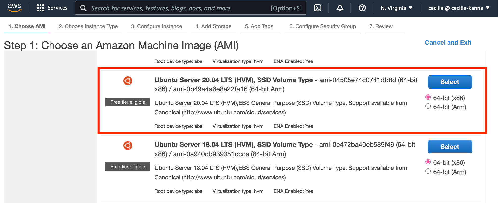
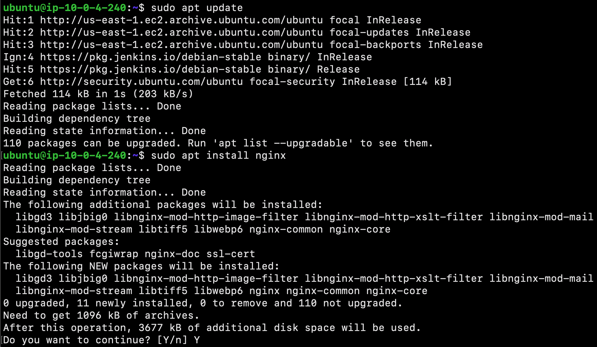
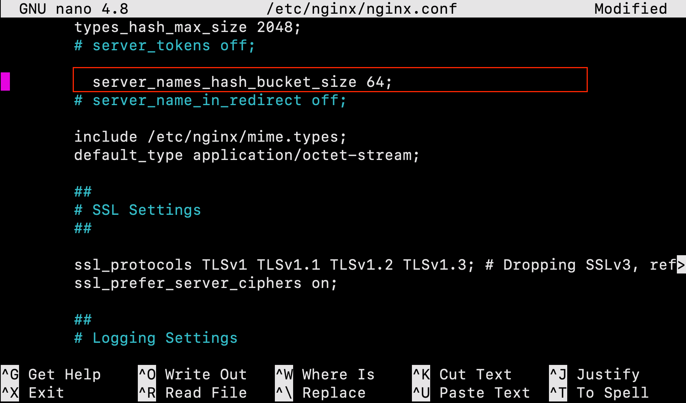
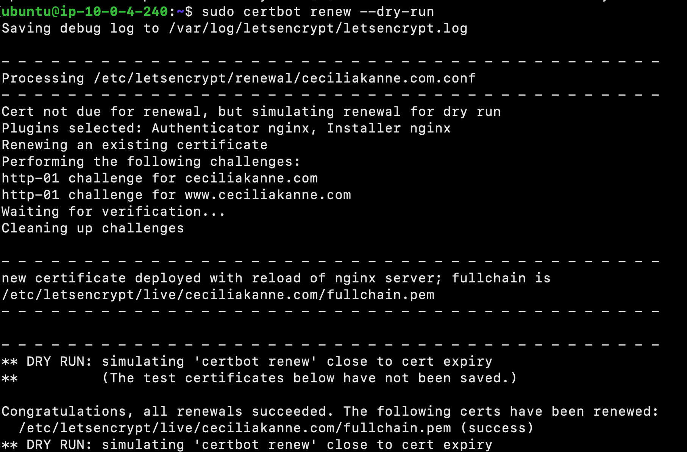
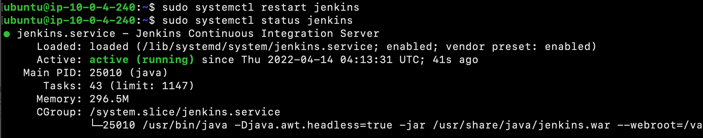
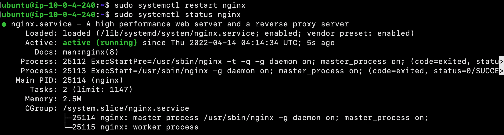

## **_CI-CD-Pipelines-in-Jenkins_**
------------------------------------------------------------
### Overview

Hello and welcome! My name is Cecilia, and in this amazing project, I will demonstrate how to set up Jenkins to automatically test a Node.js application as changes are pushed to a repository.

What is Jenkins? Jenkins is an open source automation server which is designed to  automate repetitive technical tasks within in the continuous integration and continuous delivery (CI/CD) pipeline. 


In this project, Jenkins will be integrated with Github. Github is a provider of internet hosting for software development and version control using Git. Jenkins will be alerted when new code is pushed to the specified Github repository. After Jenkins is alerted, it will then examine and test the code within Docker containers, to isolate the test environment from the Jenkins host machine!


--------------------------------------------------------------------------
### PART 1: Getting Started

Before we begin the project, there are some pre-requisite tools and software that must be installed and set up:
- Ubuntu 20.04 server
    - Jenkins
    - Oracle JDK 11
    - Nginx
    - Docker
- A registered domain name
    -  You can purchase a domain name from [Google Domains](https://domains.google/), get one for free with [Freenom](https://www.freenom.com/), or use the domain registrar of your choice.


**Installing Jenkins**

After the pre-requisites are complete, we will create an Ubuntu 20.04 server. First, sign in to the AWS Management Console. Then, navigate to the EC2 service and create an Ubuntu 20.04 server.



Select `t2.micro` as the instance type, and then leave everything else as default. Select `Review & Launch` at the bottom of the screen. Create or use an existing keypair, then launch the instance. Once the instance is running, copy the public IPv4 address.


Next, navigate to the security group inbound rules. Add a rule to allow `All Traffic` from anywhere.


Open Terminal on your local PC and then SSH into the Ubuntu server.


Next, use the following command to add the official Jenkins repository key to the system:

```
$ wget -q -O - https://pkg.jenkins.io/debian-stable/jenkins.io.key | sudo apt-key add -
```

Next, use the following command to append the Debian package repository address to the server’s `sources.list`:

```
$ sudo sh -c 'echo deb http://pkg.jenkins.io/debian-stable binary/ > /etc/apt/sources.list.d/jenkins.list'

```

Run an `update` command, so that the new repository can be utilized.

```
$ sudo apt update

```

Finally, install Jenkins and it's dependencies.

```
$ sudo apt install jenkins

```

Now that Jenkins and its dependencies are in place, we will start the Jenkins server using `systemctl`:

```
$ sudo systemctl start jenkins

```

Next, use the `status` command to verify that Jenkins started successfully:

```
$ sudo systemctl status jenkins

```


Adjust the UFU firewall rules, so that we can reach it from a web browser to complete the initial setup:

```
$ sudo ufw allow 8080

```

**_Please Note_:** If the firewall is inactive, the following commands will allow OpenSSH and enable the firewall:

```
$ sudo ufw allow ssh
$ sudo ufw enable

```

Next, check `ufw`’s status to confirm the new rules:

```
$ sudo ufw status

```


Great job! Jenkins is now installed and our firewall configured.

**Configuring Jenkins**

Enter the following in the URL of your web browser to visit Jenkins on its default port, `8080`. **_Please note: Be sure to replace the corresponding text with your Ubuntu server's IP address or domain name_**: 

```jsx
http://your_server_ip_or_domain:8080

```

You should receive the **Unlock Jenkins** screen, which displays the location of the initial password:


To retrieve the administrator password, from the terminal window of your local PC, use the `cat` command:

```
$ sudo cat /var/lib/jenkins/secrets/initialAdminPassword

```

The next screen presents the option of installing suggested plugins or selecting specific plugins:


Next, select the **Install suggested plugins** option. This will automatically begin the installation process:


Once the installation is complete, you’ll be prompted to set up the first administrative user. Enter the username and password for your user:


You’ll receive an **Instance Configuration** page that will ask you to confirm the preferred URL for your Jenkins instance. 


After confirming the appropriate information, click **Save and Finish**. You’ll receive a confirmation page confirming that **“Jenkins is Ready!”**


Excellent job! You have completed a successful installation of Jenkins.

----------------------------------------------------------------
### **PART 2: Installing Nginx on Ubuntu 20.04**


Install `Nginx` using the following commands:

```
$ sudo apt update
$ sudo apt install nginx

```



Next, we will adjust the firewall to allow access to the service. List the application configurations that `ufw` knows using the following command:

```
$ sudo ufw app list

```

It is best security practice to enable the most restrictive profile that will still allow the traffic you’ve configured. However, for this project, we will only need to allow traffic on port 80.

Enable this using the following command:

```
$ sudo ufw allow 'Nginx HTTP'

```
This configuration can be verified using the following:

```
$ sudo ufw status

```

The output will indicated which HTTP traffic is allowed:


**Checking your Web Server**

We can check with the `systemd` init system to make sure the service is running by using the following command:

```
$ systemctl status nginx

```


Great job! The service has started successfully. However, the best way to test this is to actually request a page from Nginx.

To access the default Nginx landing page and confirm that the software is running properly, we can navigate to our server’s public IP address. If you do not know your server’s IP address, it can be retrieved using the [icanhazip.com](http://icanhazip.com/) tool:

```
$ curl -4 icanhazip.com

```


Enter your server’s IP address into your browser’s address bar using the following format:

```
http://your_server_ip
```

You should receive the default Nginx landing page:


Nice job! If you have accessed this page, your server is running correctly and it is ready to be managed!

--------------------------------------------------
### **PART 2: Managing the Nginx Process**

Now that you have your web server up and running, let’s review some basic management commands!

To stop your web server, type:

```
$ sudo systemctl stop nginx

```

To start the web server when it is stopped, type:

```
$ sudo systemctl start nginx

```

To stop and then start the service again, type:

```
$ sudo systemctl restart nginx

```

If you are only making configuration changes, Nginx can often reload without dropping connections. To do this, type:

```
$ sudo systemctl reload nginx

```

By default, Nginx is configured to start automatically when the server boots. This behavior can disabled by typing:

```
$ sudo systemctl disable nginx

```

To re-enable the service to start up at boot, you can type:

```
$ sudo systemctl enable nginx

```

Excellent work! You have now learned basic management commands and should be ready to configure the site to host more than one domain.

------------------------------------------------------------------------
### PART 3: Setting Up Server Blocks

When using the Nginx web server, *server blocks* can be used to encapsulate configuration details and host more than one domain from a single server.

Before we proceed in this section, ensure that you have a registered domain name. Also ensure that both of the following DNS records set up for your server:
- An A record with `example.com` pointing to your server’s public IP address.
- An A record with `www.example.com` pointing to your server’s public IP address.


 We will create a directory structure within `/var/www` for our **your_domain** site, leaving `/var/www/html` in place as the default directory to be served if a client request doesn’t match any other sites. Create the directory for **your_domain** using the following command:

**_PLEASE NOTE: you should replace `your_domain` with your own domain name_**

```
$ sudo mkdir -p /var/www/your_domain/html

```

Next, assign ownership of the directory with the `$USER` environment variable:

```
$ sudo chown -R $USER:$USER /var/www/your_domain/html

```

To ensure that your permissions are correct use the following command:

```
$ sudo chmod -R 755 /var/www/your_domain
```

Next, create a sample `index.html` page using `nano` or your favorite editor:

```
$ sudo nano /var/www/your_domain/html/index.html

```

Inside the file, add the following sample HTML:

```html
<html>
    <head>
        <title>Welcome to your_domain!</title>
    </head>
    <body>
        <h1>Success! The your_domain server block is working!</h1>
    </body>
</html>
```


Save and close the file by pressing `Ctrl+X` to exit, then when prompted to save, `Y` and then `Enter`.

In order for Nginx to serve this content, it’s necessary to create a server block with the correct directives. Let's create a new one as follows:

```
$ sudo nano /etc/nginx/sites-available/your_domain
```

Next, add the following configuration block:

```
server {
        listen 80;
        listen [::]:80;

        root /var/www/your_domain/html;
        index index.html index.htm index.nginx-debian.html;

        server_nameyour_domain www.your_domain;

        location / {
                try_files $uri $uri/ =404;
        }
}

```


Next, enable the file by creating a link from it to the `sites-enabled` directory, which Nginx reads from during startup:

```
$ sudo ln -s /etc/nginx/sites-available/your_domain /etc/nginx/sites-enabled/
```

Great job! Two server blocks are now enabled and configured to respond to requests based on their `listen` and `server_name` directives:
- `your_domain`: Will respond to requests for `your_domain` and `www.your_domain`.
- `default`: Will respond to any requests on port 80 that do not match the other two blocks.

To avoid a possible hash bucket memory problem that can arise from adding additional server names, we must make a minor adjustment. 

First, open the file:

```
$ sudo nano /etc/nginx/nginx.conf

```

Next, scroll down and find the `server_names_hash_bucket_size` directive and remove the `#` symbol to uncomment the line. Save and close the file when you are finished.



Next, test to make sure that there are no syntax errors in any of your Nginx files:

```
$ sudo nginx -t

```

If there aren’t any problems, restart Nginx to enable your changes:

```
$ sudo systemctl restart nginx

```

Good job! Nginx should now be serving your domain name. You can test this by navigating to `http://your_domain`, where you should see something like this:


Now that you have our web server installed, we have many options for the type of content to serve and the technologies you want to use to create a richer experience!

-------------------------------------------------------------------
### **PART 3: Securing Nginx with Let’s Encrypt on Ubuntu 20.04**

In this section, we will instal the Let’s Encrypt client `certbot`, downloaded SSL certificates for your domain, configured Nginx to use these certificates, and set up automatic certificate renewal. 
 
Let’s Encrypt is a Certificate Authority (CA) that provides an easy way to obtain and install free TLS/SSL certificates, thereby enabling encrypted HTTPS on web servers.

**Installing Certbot**

Begin by installing Certbot and it’s Nginx plugin with `apt`:

```
$ sudo apt install certbot python3-certbot-nginx

```


Certbot is now ready to use!

**Confirming Nginx’s Configuration**

Certbot needs to be able to find the correct `server` block in your Nginx configuration for it to be able to automatically configure SSL. 

There should be a server block for your domain at `/etc/nginx/sites-available/example.com` with the `server_name` directive already set appropriately. To check this, open the configuration file:

```
$ sudo nano /etc/nginx/sites-available/example.com
```

Next, find the existing `server_name` line. It should look like this:


Next, save the file, quit your editor, and verify the syntax of your configuration edits:

```
$ sudo nginx -t

```

Once your configuration file’s syntax is correct, reload Nginx to load the new configuration:

```
$ sudo systemctl reload nginx
```

Certbot can now find the correct `server` block and update it automatically.


**Allowing HTTPS Through the Firewall**

Now that we have the `ufw` firewall enabled, we must adjust the settings to allow for HTTPS traffic. Use the following command to view the current settings:

```
$ sudo ufw status

```
To let in HTTPS traffic, allow the Nginx Full profile and delete the redundant Nginx HTTP profile allowance:

```
$ sudo ufw allow 'Nginx Full'
$ sudo ufw delete allow 'Nginx HTTP'

```

Next, type the following command to view the status:

```
$ sudo ufw status

```


**Obtaining an SSL Certificate**

Certbot provides a variety of ways to obtain SSL certificates through plugins. The Nginx plugin will reconfigure and reload the Nginx config as needed. To use this plugin, type the following:

```
$ sudo certbot --nginx -d example.com -d www.example.com
```

If this is your first time running `certbot`, you will be prompted to enter an email address and agree to the terms of service. 

Next, `certbot` will communicate with the Let’s Encrypt server, then run a challenge to verify that you control the domain you’re requesting a certificate for. Select your choice then hit `ENTER`. The configuration will be updated, and Nginx will reload.


Great job! Your certificates are downloaded, installed, and loaded. Try reloading your website using `https://` and notice your browser’s security indicator. It should indicate that the site is properly secured, usually with a lock icon.


**Verifying Certbot Auto-Renewal**

Let’s Encrypt’s certificates are only valid for ninety days. This is to encourage users to automate their certificate renewal process. You can query the status of the timer with `systemctl`:

```
$ sudo systemctl status certbot.timer

```


To test the renewal process, you can do a dry run with `certbot`:

```
$ sudo certbot renew --dry-run

```




-------------------------------------------------------------------

### PART 4: Configuring Jenkins with SSL using an Nginx Reverse Proxy

By default, [Jenkins](https://jenkins.io/) comes with its own built-in Winstone web server listening on port `8080`. It is best security practice to secure Jenkins with SSL, to protect passwords and sensitive data transmitted through the web interface.

Let's configure this by adding the reverse proxy settings:

```
$ sudo nano /etc/nginx/sites-available/example.com
```

In the `server` block with the SSL configuration settings, add Jenkins-specific access and error logs:

```
 
server {
        
        # SSL Configuration
        #
        listen [::]:443 ssl ipv6only=on; # managed by Certbot
        listen 443 ssl; # managed by Certbot
        access_log            /var/log/nginx/jenkins.access.log;
        error_log             /var/log/nginx/jenkins.error.log;
        
        }
```

Since we’re sending all requests to Jenkins, we’ll comment out the default `try_files` line, which would otherwise return a 404 error before the request reaches Jenkins. Next, configure and add the proxy settings.
**PLEASE NOTE:** _Be sure to substitute your SSL-secured domain name for `example.com` in the `proxy_redirect` line below_:

```
location / {
    # First attempt to serve request as file, then
    # as directory, then fall back to displaying a 404.
    try_files $uri $uri/ =404;
    include /etc/nginx/proxy_params;
    proxy_pass          http://localhost:8080;
    proxy_read_timeout  90s;
    # Fix potential "It appears that your reverse proxy setup is broken" error.
    proxy_redirect      http://localhost:8080 https://example.com;
```


Once you’ve made these changes, save the file and exit the editor. 

Test our configuration using the following command:

```
$ sudo nginx -t

```

If all is well, the command will return:


- `nginx: the configuration file /etc/nginx/nginx.conf syntax is ok`

- `nginx: configuration file /etc/nginx/nginx.conf test is successful`


If not, fix any reported errors until the test passes.

**Configuring Jenkins**

In order for Jenkins to work with Nginx, we must update the Jenkins configuration so that the Jenkins server listens only on the `localhost` interface. Modify the `/etc/default/jenkins` configuration file to make these adjustments:

```
$sudo nano /etc/default/jenkins

```

Locate the `JENKINS_ARGS` line and add `--httpListenAddress=127.0.0.1` to the existing arguments:

```
JENKINS_ARGS="--webroot=/var/cache/$NAME/war --httpPort=$HTTP_PORT --httpListenAddress=127.0.0.1"
```


Save and exit the file.

Next, restart Jenkins to use the new configuration settings:

```
$ sudo systemctl restart jenkins

```

Since `systemctl` doesn’t display output, check the status:

```
$ sudo systemctl status jenkins

```




Next, restart Nginx:

```
$ sudo systemctl restart nginx

```

Check the status:

```
$ sudo systemctl status nginx

```




Now that servers have been restarted, we can visit the domain using either HTTP or HTTPS!

**Testing the Configuration**

Now that encryption is enabled, we can test the configuration by resetting the administrative password. 

You can enter the administrative username you created in the **User** field, and the password that you selected in the **Password** field. 


Once logged in, you can change the password to be sure it’s secure. To do this, click on your username in the upper-right-hand corner of the screen. On the main profile page, select **Configure**. This will take you to a new page, where you can enter and confirm a new password:


Confirm the new password by clicking **Save**. You can now use the Jenkins web interface securely!
### Add the Jenkins User to the Docker Group

Now that Jenkins is secure, we can set up a continuous integration pipeline to automatically test code changes.  To best control our testing environment, we will run our application’s tests within Docker containers. 

By default, the Linux user responsible for running the Jenkins process cannot access Docker. To fix this, we need to add the `jenkins` user to the `docker` group:

```
$ sudo usermod -aG docker jenkins

```

Next, confirm that the `jenkins` user has been added successfully:

```
$ grep docker /etc/group

```


In order for the Jenkins to use its new membership, you need to restart the process:

```
$ sudo systemctl restart jenkins

```

Next, ensure that the `docker` and `docker-pipeline` plugins are also enabled. First, click **Manage Jenkins** from the sidebar, and then **Manage Plugins** from the next menu.


Click on the **Available** tab of the plugin menu to search for new plugins, and type `docker` into the search bar. Select both `Docker` and `Docker Pipeline`.


When finished, scroll to the bottom of the page and click `Download now and install after restart`. 


-----------------------------------------------------------------
### **PART 5: GitHub**

**Create a Personal Access Token in GitHub**

In order for Jenkins to watch your GitHub projects, we must create a Personal Access Token in our GitHub account.

Begin by visiting [GitHub](https://github.com/) and signing into your account. Next, click on your user icon in the upper-right hand corner and select **Settings** from the drop down menu:


On the page that follows, locate the **Developer settings** section of the left-hand menu:


Next, click **Personal access tokens**. Click on **Generate new token** button on the next page. You will be taken to a page where you can define the scope for your new token.

In the **Token description** box, add a description that will allow you to recognize it later:


In the **Select scopes** section, check the following boxes:
- **repo:status**
- **repo:public_repo**
- **admin:org_hook** 

These scopes will allow Jenkins to update commit statuses and to create webhooks for the project.


When you are finished, click **Generate token** at the bottom of the page. The new token will displayed:


**PLEASE NOTE: _Copy the token now so that we can reference it later. There is no way to retrieve the token once you leave this page!_**

**Add the GitHub Personal Access Token to Jenkins**

Now that we have a token, we need to add it to our Jenkins server so it can automatically set up webhooks.

Log into your Jenkins web interface using the administrative account you configured during installation.

Click on your username in the top-right corner to access your user settings, and from there, click **credentials** in the left-hand menu. 


On the next page, click the arrow next to **(global)** within the **Jenkins** scope.


In the box that appears, click **Add credentials**:


You will be taken to a form to add new credentials.

Under the **Kind** drop down menu, select **Secret text**. In the **Secret** field, paste your GitHub personal access token. Fill out the **Description** field so that you will be able to identify this entry at a later date. You can leave the Scope as Global and the ID field blank:


Click the `OK` button when you are finished.

**Set Up Jenkins Access to GitHub**

In the main Jenkins dashboard, click **Manage Jenkins** in the left hand menu. In the list of links on the following page, click **Configure System**:


Scroll through the options on the next page until you find the **GitHub** section. Click the **Add GitHub Server** button and then select **GitHub Server**.

The section will expand to prompt for some additional information. In the **Credentials** drop down menu, select your GitHub personal access token that you added in the last section.

Click the **Test connection** button. Jenkins will make a test API call to your account and verify connectivity:


When you are finished, click the **Save** button to implement your changes.

**Set Up the Demonstration Application in your GitHub Account**

To demonstrate how to use Jenkins to test an application, we will be using a [“hello world” program](https://github.com/do-community/hello_hapi) created with [Hapi.js](https://hapijs.com/). Since we are setting up Jenkins to react to pushes to the repository, you need to have your own copy of the demonstration code.

Visit the [project repository](https://github.com/do-community/hello_hapi) and click the **Fork** button in the upper-right corner to make a copy of the repository in your account:


A copy of the repository will be added to your account.

------------------------------------------------------------------------------
### **PART 6: Create a New Pipeline in Jenkins**

Next, we will set up Jenkins to use the GitHub personal access token to watch our repository. Back in the main Jenkins dashboard, click **New Item** in the left hand menu.

Enter a name for your new pipeline in the **Enter an item name** field. Afterwards, select **Pipeline** as the item type:


Scroll down to the bottom and click the **OK** button. 

On the next screen, check the **GitHub project** box. In the **Project url** field that appears, enter your project’s GitHub repository URL.


Next, in the **Build Triggers** section, check the **GitHub hook trigger for GITScm polling** box:


In the **Pipeline** section, we need to tell Jenkins to run the pipeline defined in the `Jenkinsfile` in our repository. Change the **Definition** type to **Pipeline script from SCM**.

In the new section that appears, choose **Git** in the **SCM** menu. In the **Repository URL** field that appears, enter the URL to your fork of the repository again:


When you are finished, click the **Save** button at the bottom of the page.

**Performing an Initial Build and Configuring the Webhooks**

In order to trigger Jenkins to set up the appropriate hooks, we need to perform a manual build the first time. In your pipeline’s main page, click **Build Now** in the left hand menu:

A new build will be scheduled. In the **Build History** box in the lower left corner, a new build should appear in a moment. Additionally, a **Stage View** will begin to be drawn in the main area of the interface. This will track the progress of your testing run as the different stages are completed:


In the **Build History** box, click on the number associated with the build to go to the build detail page. From here, you can click the **Console Output** button in the left hand menu to see details of the steps that were run:


Click the **Back to Project** item in the left hand menu when you are finished in order to return to the main pipeline view.

Now that we’ve built the project once, we can have Jenkins create the webhooks for our project. Click **Configure** in the left hand menu of the pipeline:

No changes are necessary on this screen, just click the **Save** button at the bottom. Now that the Jenkins has information about the project from the initial build process, it will register a webhook with our GitHub project when you save the page.

You can verify this by going to your GitHub repository and clicking the **Settings** button. On the next page, click **Webhooks** from the side menu. You should see your Jenkins server webhook in the main interface:


If for any reason Jenkins failed to register the hook (for example, due to upstream API changes or outages between Jenkins and Github), you can quickly add one yourself by clicking **Add webhook** and ensuring that the **Payload URL** is set to `https://my-jenkins-server:8080/github-webhook` and the **Content type** is set to `application/json`.


Now, when you push new changes to your repository, Jenkins will be notified. It will then pull the new code and retest it using the same procedure.

To demonstrate this, in our repository page on GitHub, click the **Create new file** button to the left of the green **Clone or download** button.


On the next page, choose a filename and some dummy contents:


Click the **Commit new file** button at the bottom when you are finished.

If you return to your Jenkins interface, you will see a new build automatically started:


You can kick off additional builds by making commits to a local copy of the repository and pushing it back up to GitHub!

----------------------------------------------------------------------
## PART 7: Clean Up

In this section, we will terminate the resources that were created during this tutorial. This will help to avoid charges from AWS.

Navigate to the AWS management console, and terminate the EC2 instance.


Next, remove the DNS records from your domain name.


----------------------------------------------------------------------

Wonderful job! Thank you for viewing my project and following along. We learned how to configure Jenkins to watch a GitHub project and automatically test any new changes that are committed. Jenkins pulled code from the repository and then ran the build and testing procedures from within isolated Docker containers. The resulting code was deployed by adding additional instructions to the same Jenkinsfile. 

I hope you enjoyed it! For more details on similar projects and more, please visit my GitHub portfolio: https://github.com/ceciliacloud


